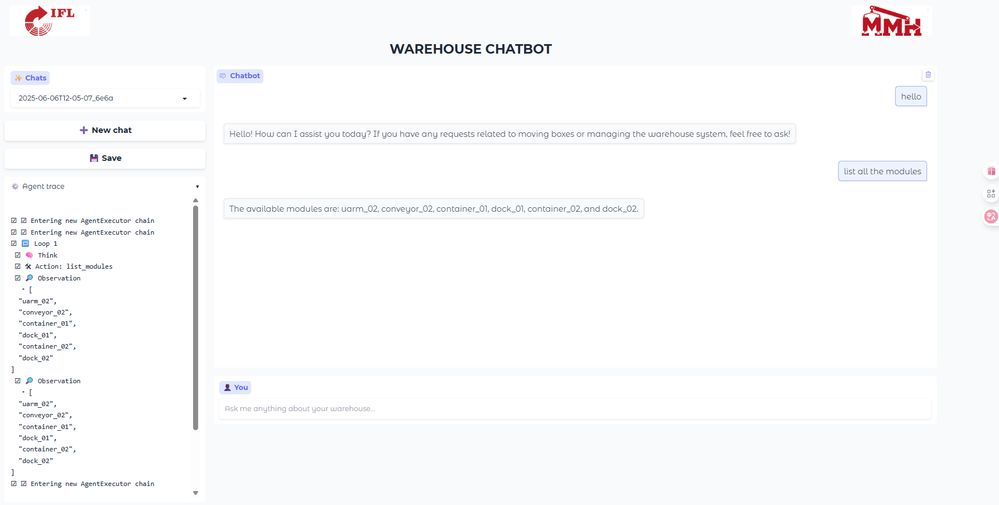

# Human-in-the-Loop Control of Modular Material-Handling Systems Using an LLM Agent

**Author**: Hind Makarem  
**Affiliation**: CPS2 Master’s Internship – Université Jean Monnet (France) & Karlsruhe Institute of Technology (Germany)  
**Date**: July 2025

---

## Project Overview

This project demonstrates how a lightweight large-language model (LLM) agent can supervise and control a modular material-handling system using natural language. The agent interfaces with real-time MQTT data from a mini-warehouse and dispatches commands to conveyor belts, uArm manipulators, and autonomous mobile robots (AMRs).  

The system enables:
- Natural-language warehouse control via Gradio or terminal.
- Tool-assisted planning and error handling using a ReAct-based LLM agent.
- Full integration with physical hardware over MQTT.

You can find more detailes in the final report: https://drive.google.com/file/d/13rG88XYNQ7N0OOURhNMmfSqevb8P6ioh/view?usp=sharing

---

## Project Structure

```
.
├── agent.py               # LangGraph planner with tool-chaining (first draft of the agent)
├── react_agent.py        # LangChain zero-shot ReAct agent (Gradio)
├── tools.py              # Domain-specific tools for warehouse control
├── app.py                # Gradio interface (UI)
├── main.py               # CLI interface for terminal usage
├── mqtt_listener.py      # MQTT subscriber and snapshot cache
├── models.py             # Pydantic types + MQTT message normalizer
├── snapshot.json         # Sample snapshot of live MQTT state
├── requirements.txt      # Python dependencies
```

---

## Project Goals

- Enable non-technical users to control an intralogistics system via natural language.
- Design and evaluate a ReAct agent capable of tool invocation, clarification, and fallback.
- Support transport orders, cancellations, planning, and live status monitoring.
- Demonstrate that a fully local, on-premise LLM (Qwen-3: Latest) can match latency and reliability needs.

---

## Setup & Installation

## Quick Start

```bash
# Clone & install
git clone https://gitlab.kit.edu/kit/ifl/forschung/mmh_lab/projects/mmh_agent/human-in-loop-warehouse.git
cd .\warehouse_chat\
python3 -m venv .venv && source .venv/bin/activate
pip install -r requirements.txt   # see requirements.txt for Python deps

```
### Prerequisites

- Python 3.10+
- A running MQTT broker (default: `192.168.50.100`) (do not forget to connect to one of the mmh lab wifi networks; like `MMH_LAB_5Ghz` password: `ifl_2022` or `MMH_LAB_2Ghz` password: `ifl_2022`)
- An Ollama-compatible model (tested with `qwen3:latest`) (you need to pull it and use it locally)


## Running the System

### 1. Terminal Interface (CLI)

```bash
python main.py #make sure that you are in 'warehouse_chat' dir
```
to quit you can type: ctrl+c

You can type commands like:
```
move box 0 from conveyor_02 to container_01
cancel the current order
where is the green box?
```

The agent will:
- Chain tool calls (`find_box`, `trigger_order`, etc.)
- Wait for MQTT response to confirm success/failure
- Explain what it did, or ask for clarification

---

### 2. Gradio Web Interface

```bash
gradio app.py #make sure that you are in 'warehouse_chat' dir
```

Then open the Gradio UI in your browser (usually at http://localhost:7860).


---

## Available Capabilities

The agent supports natural-language queries such as:

| Example Question | What it Does |
|------------------|--------------|
| "Move box 1 to container_02" | dispatches order |
| "Where is the red box?" | Finds box position |
| "Revert the last order" | Return the box |
| "List all modules" | Returns module list |
| "Which module is closest to (x,y)?" | Runs spatial matching |
| "Why did the last order fail?" | Diagnostic reasoning |

---

## Tooling and Integration

- **MQTT Topics**: System listens to `mmh_cam/detected_boxes`, `base_01/order_request`, etc.
- **LLM Agent**: Built using `LangGraph`, `LangChain`, and `ChatOllama`
- **Snapshot Store**: Live MQTT messages are normalized into typed `Envelope` objects (`models.py`)

---

## 📎 Acknowledgments

This project was completed at the Institute for Material Handling and Logistics (KIT) under the supervision of M.Sc. Lars Ohnemus. Thanks to the MMH Lab team for their continuous support.
